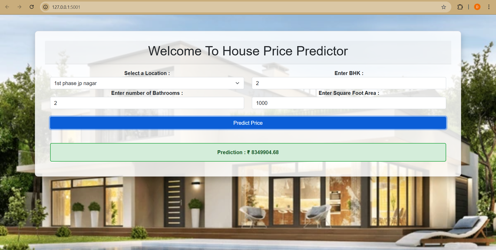

# 🏠 Banglore House Price Predictor Project

A web-based machine learning project to **predict house prices in Bangalore** based on user inputs such as location, total square footage, number of bedrooms (BHK), and number of bathrooms.

This project uses a trained machine learning model with a **Flask backend** and a **Bootstrap-based frontend** to provide real-time predictions in a user-friendly interface.

## 📂 Project Structure

Banglore_House_Price_Predictor_Project/
main.py # Flask backend application
banglore_home_prices_model.pickle # Trained ML model
columns.json # Feature columns used by the model
House_price_prediction.ipynb # Notebook for training & saving the model
templates/
   -try.html # HTML frontend for the user interface

## 🚀 Features

Predicts house prices in Lakhs for various locations in Bangalore
Dynamic form input: Location, BHK, Bathrooms, Total Sqft
Real-time prediction using AJAX (without page reload)
Stylish background and a green-colored result box showing predicted price
Easily extendable to other cities/datasets

## 🛠️ Technologies Used

Frontend - HTML, CSS, Bootstrap 
Backend - Flask (Python)       
Machine Learning - Scikit-learn, NumPy  
Data Handling - Pandas, JSON         
Visualization - Jupyter Notebook     
Deployment-Read - Flask Routing, Model Serving 

## ⚙️ How to Run Locally

1. **Clone the repository**:
   git clone https://github.com/your-username/Banglore_House_Price_Predictor_Project.git
   cd Banglore_House_Price_Predictor_Project
2. **Install dependencies (optional virtual environment recommended)**:
   pip install flask numpy scikit-learn pandas
3.**Run the Flask app:**
   python main.py
4.**Open in your browser:**
   http://127.0.0.1:5001/

##  Files Explained

main.py: Flask app that serves the model and frontend
banglore_home_prices_model.pickle: Saved trained model
columns.json: List of features (columns) used for prediction
House_price_prediction.ipynb: Notebook that loads data, trains model, and saves .pickle and .json
templates/try.html: Frontend HTML file with form and style

## 📄 License

This project is for educational purposes. You are free to use it for learning and personal use.

